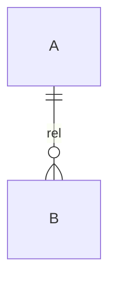

# {功能/领域} · Product Logic Spec

> 模板说明：复制本文件到 `{模块}/references/{page}-logic.md`（页面合同）或 `{模块}/references/models/{domain}.md`（跨页面模型），逐节填写。§0 的状态随 Gate 推进更新。**本文件不是 HTML 实现指令**——下游是页面规格与 frontend-design。

## 0. 文档状态

- 状态：Draft / Model Review（Gate A）/ Behavior Review（Gate B）/ Approved（Gate C）
- 负责人 / 日期 / 适用页面：
- 下游产物：

## 1. 真源与版本路由

| Source ID | 文档 | 版本/地位 | 采用内容 | 冲突或疑问 |
|-----------|------|-----------|----------|-----------|
| SRC-01 | | | | |

### 1.1 运行真源链（跨角色 / 跨端 / 多 renderer 时必填）

| 事实 / 内容 | Canonical owner + revision | Usage / binding | Session snapshot | Runtime event | Presentation / preview | Evidence |
|---|---|---|---|---|---|---|
| | | | | | | |

## 2. 场景与边界

### 核心场景
{谁在什么时刻，要解决什么问题}

### JTBD（仅新方向）
When …, I want …, So I can …

### In Scope
### Out of Scope（明确不做）
### 成功信号

## 3. 角色能力与工作台边界

### Actor Cards

#### Actor: {角色名}
- 核心结果：
- Top tasks / 使用频率：
- 专业能力：
- 不应要求掌握：
- 决策权 / 必须转交：
- 可见对象：
- 复杂度预算：
- 专家升级：

### Role–Task–Object Matrix
| 角色 | Top task | 业务对象/意图 | 可直接操作 | 只读/摘要 | 必须转交 |
|---|---|---|---|---|---|
| | | | | | |

### Role–Surface Access Matrix
| 页面/工作台 | 主要角色 | 次要角色 | 默认可见 | 专家模式 | 禁止出现 |
|---|---|---|---|---|---|
| | | | | | |

### Intent–System Translation Matrix
| 用户意图语言 | 目标角色 | 系统对象/规则 | 自动生成/建议 | 专家可见证据 | 用户侧错误表达 |
|---|---|---|---|---|---|
| | | | | | |

## 4. 参与角色与服务蓝图（仅多角色/多端功能）

| 阶段 | 孩子 | 主教 | 助教 | 学生端 | 大屏 | 后台 | 系统/数据 |
|------|------|------|------|--------|------|------|-----------|
| | | | | | | | |

交接点与降级：

## 5. 对象模型（ORCA）

### 对象关系图


### 对象卡
#### Object: {名称}
- 标识：
- 所有者：
- 定义：
- Relationships：
- CTAs（按状态）：
- Attributes：
- Invariants：
- Permissions：

## 6. 信息架构

### IA Thesis
{组织原则声明 + 例外及理由}

### App Map
```
```

### Navigation Role Matrix
| 入口 | 目标 | 角色（Global/Local/Contextual/Shortcut/Action） | 出现位置 | 重复路径理由 |
|------|------|------|----------|--------------|
| | | | | |

## 7. 状态与转换

### 状态模型（按对象）
### 转换表
| From | Trigger | Guard | To | Side effect | Recovery |
|------|---------|-------|----|-------------|----------|
| | | | | | |

### 7.1 事件与反馈投影

| Event / Action ID | 语义 owner | Commit? | 业务结果 | 用户回执 | 系统 / AI 反馈 | 非提交 Echo | A/B / 多端差异 |
|---|---|---:|---|---|---|---|---|
| | | | | | | | |

## 8. 关键任务流（Top 1-3）

### UC-01 {名称}
- Actor：
- Preconditions：
- Main Flow：
- Alternate Flow：
- Postconditions：

## 9. 页面 Audience Contract

- 主要角色：
- 次要角色 / 进入方式：
- 使用情境：
- 已知业务概念：
- 不应要求掌握：
- 复杂度预算：
- 默认业务语言 / 允许专家词 / 禁止主视觉工程证据：
- 超出边界后的转交与返回：

## 10. 页面层级合同

- 页面唯一任务：
- 页面主对象：

### 注意力排序
| 排名 | 用户此刻的问题 | 内容/对象 | CTA | 强调级别 | 不得与谁竞争 |
|------|----------------|-----------|-----|----------|--------------|
| 1 | | | | | |
| 2 | | | | | |
| 3 | | | | | |

### 操作分级
主操作（每区一个）/ 次操作（文字链）/ 低频操作：

### 明确不在本页（边界声明）
-

## 11. 视图状态矩阵
| 页面区块 | Default | Empty | Loading | Error | Interrupted | Permission |
|----------|---------|-------|---------|-------|-------------|------------|
| | | | | | | |

## 12. 组件映射
| 组件 | 对象 | 状态 | CTA | 数据来源 | 点击后结果 |
|------|------|------|-----|----------|-----------|
| | | | | | |

### 真实预览 / 多 renderer 合同（适用时）

- Preview source + revision：
- Resolved manifest / fixture：
- Shared action core / renderer contract：
- 内容与全局运行控件边界：
- 变体与 stale / rebuild：

## 13. 需求追踪
| Req ID | 产品规则 | 角色/工作台 | 对象/状态 | 页面/组件 | 验收条件 |
|--------|----------|-------------|-----------|-----------|----------|
| | | | | | |

## 14. 待决策与风险
-
